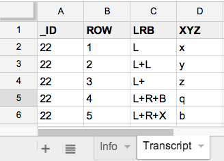

# parse-xlsx

A simple module and CLI for parsing tabular data in an excel worksheet.

The parser assumes that the first line of your table contains column headers:




## Usage

    npm install -g parse-xlsx
    npm run test
    npm run demo
    npm run cli-demo

The CLI (`bin/xlsx2ldj`) takes an excel file as input and generates line-delimited JSON as output:

    xlsx2ldj --sheet=Transcript sample.xlsx

Output ...

```javascript
{"_ID":"22","ROW":"1","LRB":"L","XYZ":"x"}
{"_ID":"22","ROW":"2","LRB":"L+L","XYZ":"y"}
{"_ID":"22","ROW":"3","LRB":"L+ ","XYZ":"z"}
{"_ID":"22","ROW":"4","LRB":"L+R+B","XYZ":"q"}
{"_ID":"22","ROW":"5","LRB":"L+R+X","XYZ":"b"}
```


The module can be used to get particular column values or stream records:

```javascript
var Parser = require('parse-xlsx');
        
sheet = new Parser('sample.xlsx', 'Transcript');

// get values in a column
console.log('\nValues in column `XYZ`:', sheet.values('XYZ'), "\n");

// stream parsed records as line-delimited JSON
sheet.recordStream.pipe(process.stdout);
```

Output ...

    Values in column `XYZ`: [ 'x', 'y', 'z', 'q', 'b' ] 

    {"_ID":"22","ROW":"1","LRB":"L","XYZ":"x"}
    {"_ID":"22","ROW":"2","LRB":"L+L","XYZ":"y"}
    {"_ID":"22","ROW":"3","LRB":"L+ ","XYZ":"z"}
    {"_ID":"22","ROW":"4","LRB":"L+R+B","XYZ":"q"}
    {"_ID":"22","ROW":"5","LRB":"L+R+X","XYZ":"b"}

